# 🌿 Plant Disease AI Detection

*An intelligent web application that identifies agricultural plant diseases from a leaf photo, using a fine-tuned AlexNet convolutional neural network.*

🎓 **Bachelor's Diploma Project, 2020**
✨ *Repository restored and documented in 2026 for archival and portfolio purposes.*

> **Historical note.** Everything about the model, code, dataset, and results below is exactly what existed in 2020 — nothing has been retrained or improved. The structure, README, and English documentation were written in 2026 to make the original work legible today. See [Historical Context](docs/historical-context.md) for exactly where that line is drawn.

---

## ℹ️ About

🌾 Plant diseases are a major threat to food security all over the world — they hit yield *and* quality for growers of food, fiber, **and** biofuel crops all at once.
🦠 Plant pathogens can be viral, fungal, or bacterial, damaging plant parts above or below the ground.
🤖 This app is an image-recognition system that detects and classifies diseases across **14 crop species**: 🍎 apple, 🫐 blueberry, 🍒 cherry, 🌽 corn, 🍇 grape, 🍊 orange, 🍑 peach, 🫑 pepper, 🥔 potato, 🍓 raspberry, 🫘 soybean, 🎃 squash, 🍓 strawberry, and 🍅 tomato.
📸 Upload a photo → 🧠 get a diagnosis → 💊 get a treatment recommendation.

*(Paraphrased from the app's own in-product About page — see it below.)*

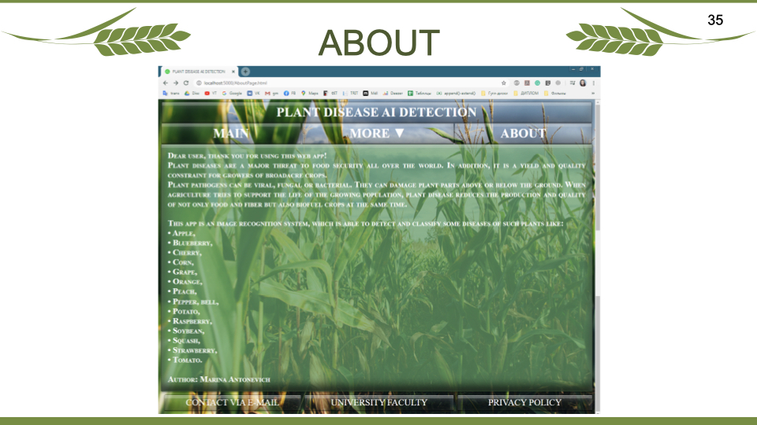

---

## 🧭 Quick Navigation

| | | |
|---|---|---|
| [📌 Overview](#-overview) | [🏗️ Architecture](#️-system-architecture) | [📊 Dataset](#-dataset) |
| [🤖 Model](#-model) | [🖥️ Application](#️-application-interfaces) | [🗂️ Repo Structure](#️-repository-structure) |
| [🚀 How to Run](#-how-to-run) | [📈 Results](#-results) | [📚 Thesis](#-thesis) |
| [🎞️ Presentation](#️-presentation) | [⚠️ Limitations](#️-limitations) | [👩‍💻 Author](#-author) |

---

## 📌 Overview

### ❓ Problem Statement

Crop disease is a major threat to global food security, and it hits hardest where it hurts most: smallholder farmers, who produce most of the world's food, lose 20–40% of edible-crop yield every year to pests and disease. Diagnosing plant disease normally takes an expert eye — a bottleneck for farmers who don't have easy access to one.

### 💡 Solution Summary

This project automates that diagnosis. A user uploads a photo of a plant leaf, a fine-tuned **AlexNet** model classifies it into one of **38 classes** (26 diseases across 14 crops, plus healthy), and — for diseased results — a **MySQL**-backed lookup surfaces the pathogen, a description, and recommended treatments. Every classification and treatment gets logged for later review.

---

## 🖼️ Project Preview

*Real artifacts from the original 2020 build — application UI, system design diagrams, and training results.*

| Application UI | Case History |
|---|---|
| 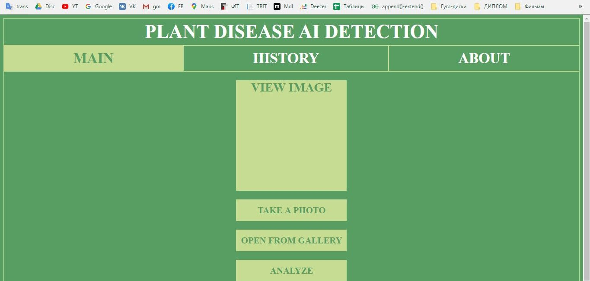 | 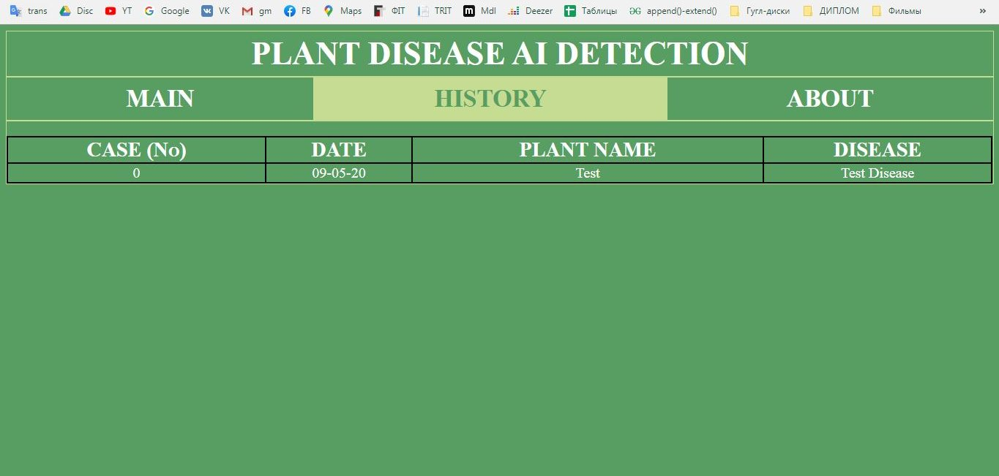 |

| Training Accuracy | Training Loss |
|---|---|
|  | 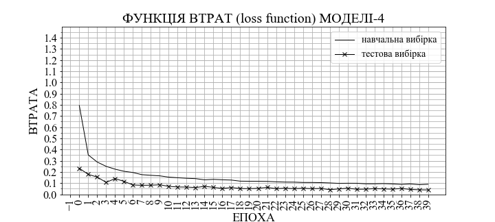 |

| System Data Flow | Structural Diagram |
|---|---|
| 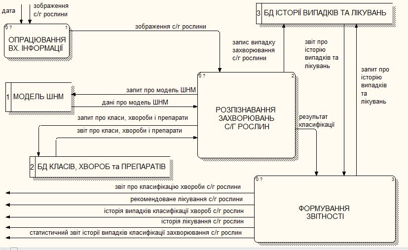 | 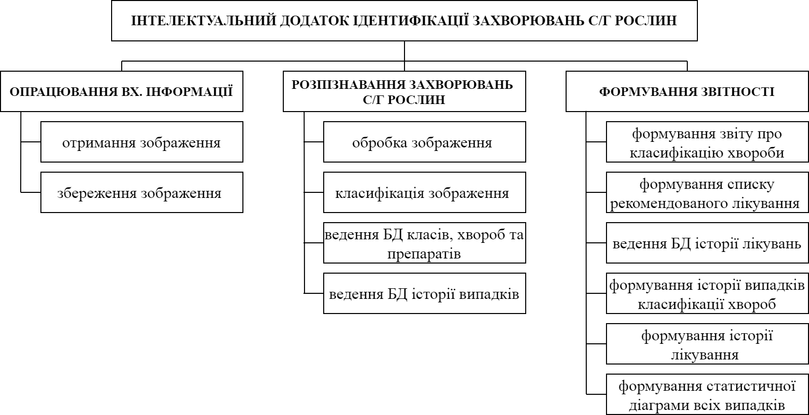 |

> 📸 Screenshots are lightly cropped from original 2020 desktop captures (removing browser chrome/taskbar) — nothing in them has been redrawn or fabricated.

---

## 🏗️ System Architecture

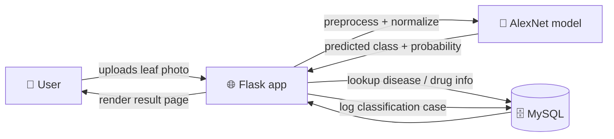


Full breakdown (components, data flow, what changed during restoration): [`docs/architecture.md`](docs/architecture.md).

---

## 🧠 Machine Learning Pipeline

### 📊 Dataset

**[PlantVillage](data/README.md)** — 54,306 leaf images, 38 classes (12 healthy, 26 diseased), 14 crop species. 80/20 train/test split on the segmented image variant. *Not redistributed in this repo* — see [`data/README.md`](data/README.md) for how to obtain it.


### 🤖 Model

| | |
|---|---|
| Architecture | AlexNet (5 conv + 3 FC layers), transfer-learned from ImageNet |
| Training | Fine-tuned end-to-end, 40 epochs, batch size 128 |
| Hardware | CPU only, 16 GB RAM |
| **Best accuracy** | **0.987833** on the PlantVillage test split |

Full training comparison across 4 configurations: [`docs/results.md`](docs/results.md). Scope, intended use, and limitations: [`MODEL_CARD.md`](MODEL_CARD.md).

---

## 🖥️ Application Interfaces

- **🌐 Flask web app** (`app/web/`) — the main product. 9 pages: home, upload & analyze, case history, add/view treatment, statistics, about, privacy policy.
- **📱 Kivy prototype** (`app/kivy/`) — a partial, parallel mobile UI experiment (3 screens), not wired to the model or database.
- **🗄️ MySQL integration** (`database/`) — schema for diseases, drugs, treatment instructions, and logged classification/treatment history.

### 📸 More App Screens

| 📤 Upload a Photo | 🔬 Classification Result |
|---|---|
| 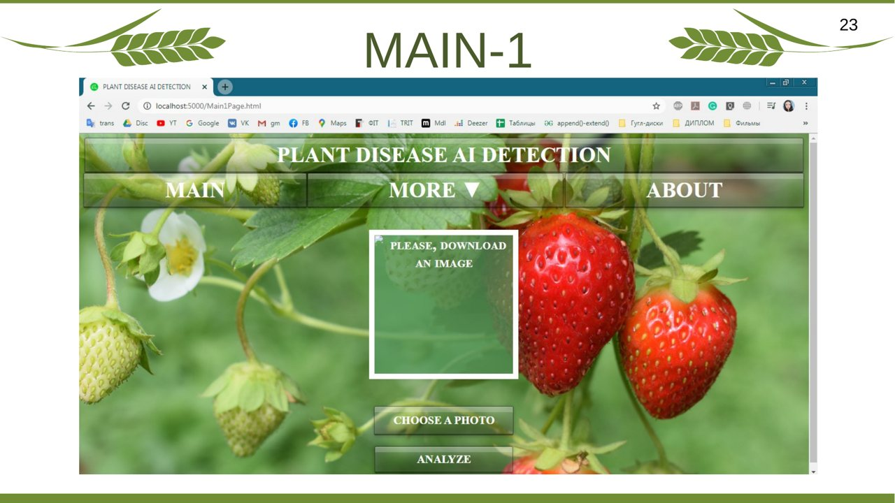 | 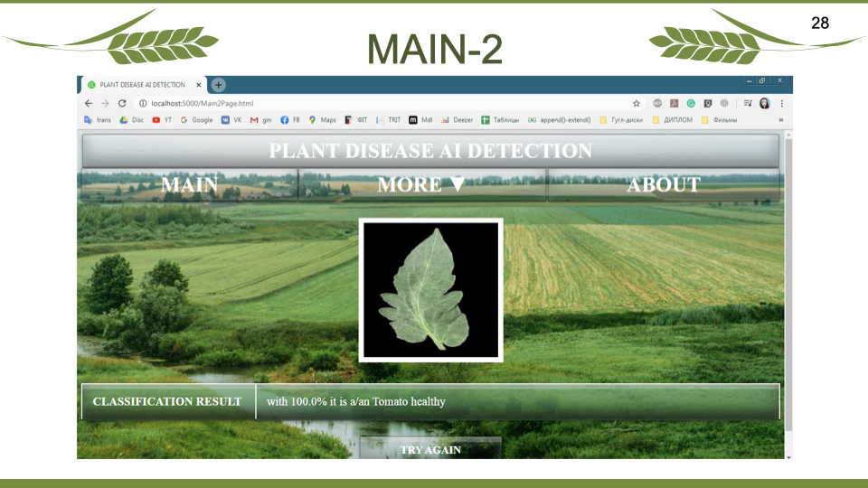 |

| 💊 Add Treatment | 🧾 Treatment History |
|---|---|
| 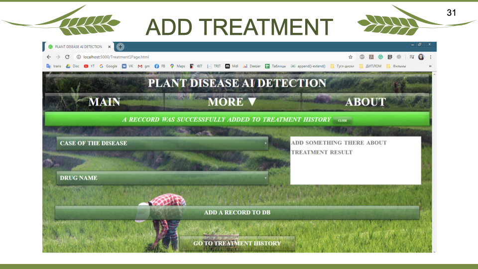 | 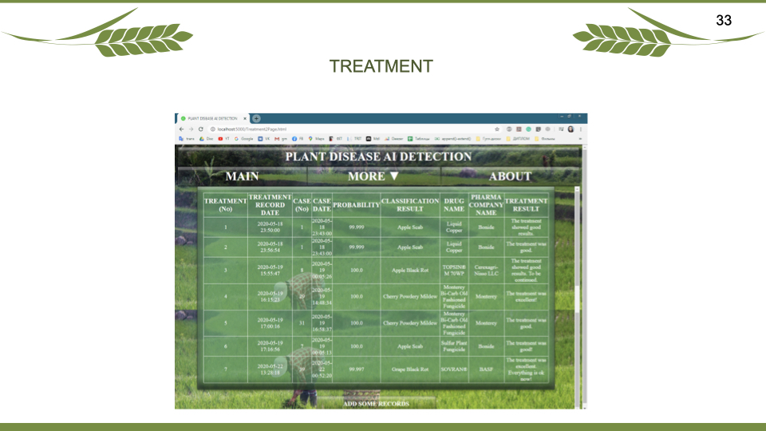 |

---

## 🗂️ Repository Structure

```text
app/
├── web/            🌐 Flask application (main product)
└── kivy/           📱 Partial Kivy mobile UI prototype
scripts/
├── training/       🏋️ Model training (train_alexnet.py)
├── evaluation/      📉 Accuracy/loss plotting
└── data/           🔀 Dataset sampling/splitting
database/           🗄️ MySQL schema + connectivity script
docs/
├── thesis/         📚 Final thesis PDF
├── presentation/   🎞️ English adaptation of the defense presentation
└── *.md            🏗️ architecture, methodology, results, history, deployment notes
data/               📊 Dataset documentation (not the dataset itself)
archive/            🗃️ Superseded/experimental scripts, kept for reference
MODEL_CARD.md        🤖 Model scope & limitations
```

---

## 🚀 How to Run

Honest disclosure: this is a 2020 codebase with no pinned dependency versions and CPU-only training assumptions.

1. Obtain the [PlantVillage dataset](data/README.md) and the trained model weights (not included — see [`MODEL_CARD.md`](MODEL_CARD.md) and [`docs/future-deployment.md`](docs/future-deployment.md)).
2. Set up MySQL and apply [`database/plant_disease_sql_script.sql`](database/plant_disease_sql_script.sql).
3. Set environment variables: `MYSQL_HOST`, `MYSQL_USER`, `MYSQL_PASSWORD`, `MYSQL_DATABASE`, `FLASK_SECRET_KEY`.
4. Install dependencies per [`requirements-legacy.txt`](requirements-legacy.txt) — only `torch==1.5.0`/`torchvision==0.6.0` are confirmed-accurate; the rest are unpinned in the original project.
5. Run `app/web/web_application.py`.

> ⚠️ A model pickled with PyTorch 1.5 may not load cleanly on a modern PyTorch version, and Flask's API has shifted since 2020. This has not been re-verified against a current environment — see [`MODEL_CARD.md`](MODEL_CARD.md) for the honest run-status call.

---

## 📈 Results

| Model | Method | Epochs | Accuracy |
|---|---|---|---|
| 1 | feature extraction | 15 | *did not finish (interrupted)* |
| 2 | feature extraction | 13 | 0.884045 |
| 3 | feature extraction | 20 | 0.897594 |
| **4 (deployed)** | fine-tuning | 40 | **0.987833** |

Full table with hardware/timing: [`docs/results.md`](docs/results.md).

### 🧪 Experiment Slide

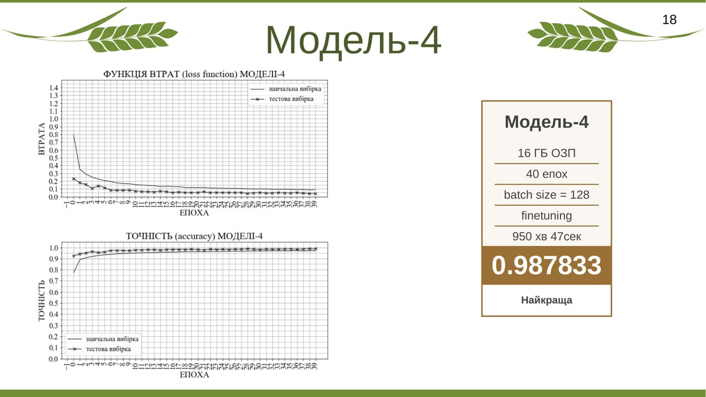

---

## 📚 Thesis

📄 Full thesis (Ukrainian, PDF): [`docs/thesis/Antonevych_diploma_thesis_2020_final.pdf`](docs/thesis/Antonevych_diploma_thesis_2020_final.pdf)

## 🎞️ Presentation

🇺🇦 Original Ukrainian defense deck (38 slides): [`.pptx`](docs/presentation/original/Antonevych_bachelor_defense_presentation_2020_original.pptx) · [`.pdf`](docs/presentation/original/Antonevych_bachelor_defense_presentation_2020_original.pdf)
🇬🇧 Full slide-by-slide **English adaptation**: [`docs/presentation/english/presentation-en.md`](docs/presentation/english/presentation-en.md)
🖼️ Complete 38-slide visual gallery: [`docs/presentation/`](docs/presentation/README.md)

| Title Slide | AlexNet Architecture |
|---|---|
|  |  |

---

## 🕰️ Historical Context

See [`docs/historical-context.md`](docs/historical-context.md) for what "2020" and "2026" each mean here, and why some material from the original source drive was intentionally left out.

## ⚠️ Limitations

- Evaluated only on the PlantVillage benchmark — no field-condition validation.
- Only overall accuracy is reported; no precision/recall/F1/confusion matrix.
- CPU-only training limited experimentation to 4 configurations.
- Trained model weights (~228 MB) are not included in this repository.

## 🔮 What I Would Improve Today

*Not part of the original 2020 work — noted separately, per the restoration scope.* A modern re-implementation would likely use a stronger backbone (EfficientNet or a ViT) with GPU training, add real precision/recall/F1 evaluation plus a held-out field-photo test set, containerize the app, and move image storage off local disk.

---

## 👩‍💻 Author

**Maryna Antonevych** — [github.com/marine-ai-dev](https://github.com/marine-ai-dev)

## 📄 License

MIT (see [LICENSE](LICENSE)) for the original author's own code. The PlantVillage dataset is third-party and not covered by this license — see [`data/README.md`](data/README.md).
