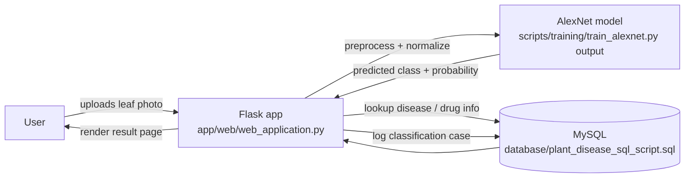

# Architecture

Reconstructed from the actual source code (`app/web/web_application.py` and
related scripts), not from the diagrams alone — this reflects what the code
does, not just what was designed.

## Data flow

## Components

- **Training pipeline** (`scripts/training/train_alexnet.py`): loads
  PlantVillage via `torchvision.datasets.ImageFolder`, fine-tunes a
  pretrained AlexNet with SGD, saves the resulting weights.
- **Data sampling** (`scripts/data/sampling_80_20.py`): splits the dataset
  80/20 into train/validation folders.
- **Web application** (`app/web/web_application.py`): a single Flask app
  serving 9 pages (home, upload/analyze, history, add/view treatment,
  statistics, about, privacy policy). Loads the trained model once at
  startup, runs inference on uploaded images, and reads/writes disease,
  drug, and case-history records via a MySQL connection.
- **Database** (`database/`): MySQL schema with `DISEASE`, `CLASS`, `DRUG`,
  `DRUG_and_DISEASE`, `CASE_OF_THE_DISEASE`, and `TREATMENT_HISTORY` tables.
- **Kivy prototype** (`app/kivy/`): a separate, partial mobile UI prototype
  (3 screens) with no model or database wiring — an early/parallel
  experiment, not a complete second client.
- **Evaluation/visualization** (`scripts/evaluation/draw_a_plot.py`): plots
  accuracy/loss curves from the raw per-epoch logs of each training run.

## What changed during restoration (2026)

- Hardcoded Windows absolute paths were replaced with paths relative to the
  script location.
- The hardcoded MySQL password and Flask session secret key were replaced
  with environment-variable reads (`MYSQL_PASSWORD`, `FLASK_SECRET_KEY`).
- No algorithmic or behavioral changes were made to the training or
  inference logic.
