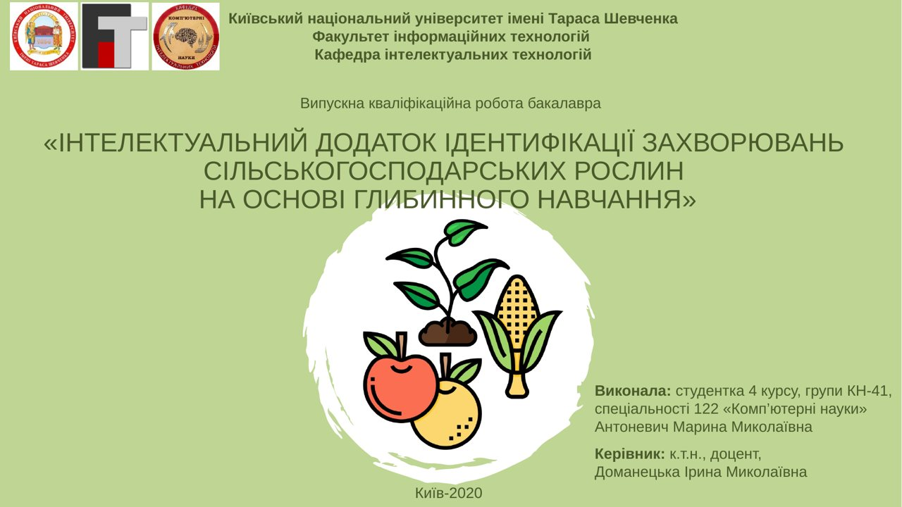
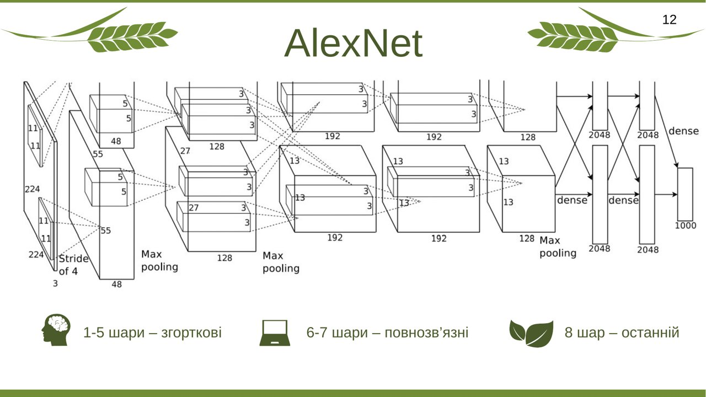
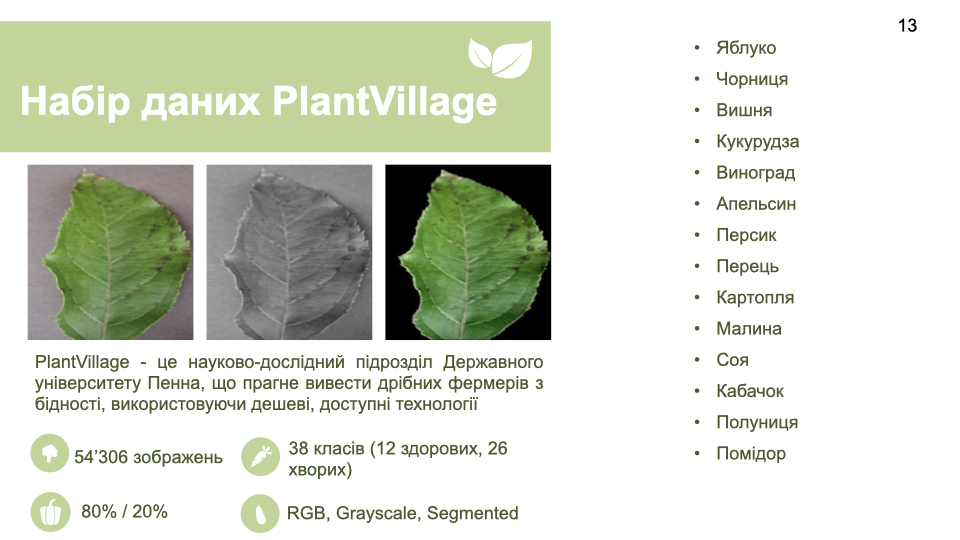
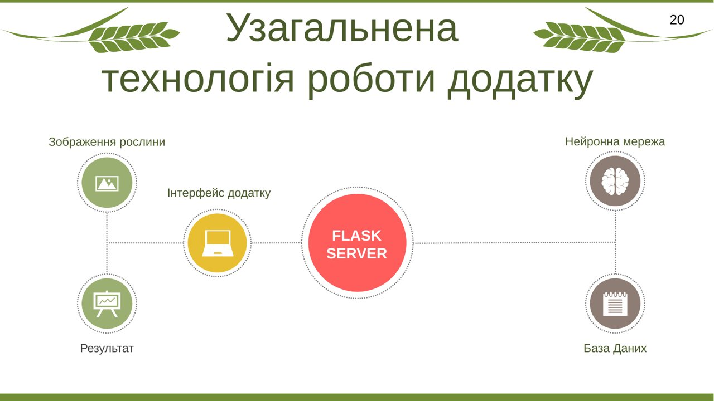

# 🎞️ Defense Presentation

🎓 **Title:** Intelligent Application for Identifying Diseases of Agricultural Plants Based on Deep Learning
👩‍💻 **Author:** Maryna Antonevych — Taras Shevchenko National University of Kyiv, 2020

## 🇺🇦 Original presentation

The complete original Ukrainian defense deck (38 slides) is archived here in
full:
- [`.pptx`](original/Antonevych_bachelor_defense_presentation_2020_original.pptx) (22,608,707 bytes) — the original file, byte-for-byte
- [`.pdf`](original/Antonevych_bachelor_defense_presentation_2020_original.pdf) — a PDF export (via LibreOffice) for quick viewing without PowerPoint/Keynote

## 🇬🇧 English adaptation

A full, natural-English slide-by-slide adaptation of the presentation's
content (not a literal machine translation — technical claims and figures
are preserved exactly): [`english/presentation-en.md`](english/presentation-en.md).

## 🖼️ Complete slide gallery

[`slides/`](slides/) contains rendered previews of **all 38 slides**
(`slide-01.jpg` … `slide-38.jpg`) of the original deck.

A few highlights:

| Title Slide | AlexNet Architecture |
|---|---|
|  |  |

| PlantVillage Dataset | Application Workflow |
|---|---|
|  |  |

Browse the full set in [`slides/`](slides/) for the rest — relevance
statistics, DFD diagrams, per-model training curves, the complete
application walkthrough, and the conclusions slide.

> 🔒 Two slides (36 and 38) originally displayed personal Gmail addresses
> (the author's and her supervisor's) in on-screen UI/contact text. Those
> addresses have been redacted (blacked out) in the committed images —
> everything else on those slides is untouched.

## 🚫 Excluded from this repository

Several files found alongside the presentation in the original source folder
were **not** included, because they are not this author's own work or are
personal/private material:

- Presentations belonging to other students (different authors entirely)
- Video recordings of the live defense session and grade announcements
- A generic, unrelated stock PowerPoint template
