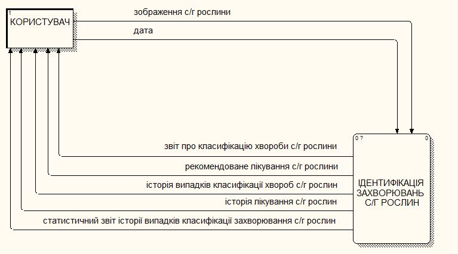

# 🎞️ Defense Presentation

🎓 **Title:** Intelligent Application for Identifying Diseases of Agricultural Plants Based on Deep Learning
👩‍💻 **Author:** Maryna Antonevych — Taras Shevchenko National University of Kyiv, 2020

## 🇺🇦 Original presentation

The original Ukrainian defense deck, `Антоневич_презентація_диплом_v4.pptx`
(~22.6 MB), is **not committed to this repository**. It exceeded the size
limit of the Google Drive access tooling available during this restoration
(a 10 MB per-file cap), and no other safe retrieval path (local Drive sync,
CLI tooling, or an authenticated browser session) was available in this
environment. It remains archived in the author's Google Drive. This is a
tooling limitation, not a privacy or licensing exclusion — nothing here is
hidden on purpose.

## 🇬🇧 English adaptation

A full, natural-English slide-by-slide adaptation of the presentation's
content (not a literal machine translation — technical claims and figures
are preserved exactly): [`english/presentation-en.md`](english/presentation-en.md).

## 🖼️ Slide preview gallery

Per-slide screenshot rendering (`slides/slide-01.png`, etc.) was not produced
in this pass — that requires converting the original `.pptx` (see above), which
could not be retrieved. In its place, here are real diagrams and results the
presentation itself was built around, pulled directly from the 2020 project
source rather than recreated:

| DFD — Context Level | DFD — Level 1 |
|---|---|
|  |  |

| Structural Diagram | Training Accuracy |
|---|---|
|  |  |

These are the same visuals featured in the root [README](../../README.md#️-project-preview).

## 🚫 Excluded from this repository

Several files found alongside the presentation in the original source folder
were **not** included, because they are not this author's own work or are
personal/private material:

- Presentations belonging to other students (different authors entirely)
- Video recordings of the live defense session and grade announcements
- A generic, unrelated stock PowerPoint template
